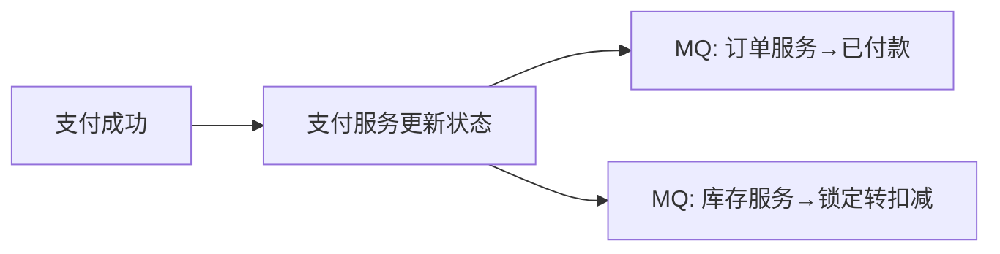

# 分布式商城管理系统 — 需求分析文档

> **项目名称**：Mall — 分布式商城管理系统  
> **技术栈**：Spring Boot 3.2.0 + Spring Cloud 2023.0.0 + Spring Cloud Alibaba 2023.0.1.0 + MyBatis 3.0.3 + MySQL 8.0  
> **架构风格**：微服务 + 前后端分离  
> **文档版本**：v1.0  
> **编写日期**：2026-07-27

---

## 目录

1. [项目背景与目标](#1-项目背景与目标)
2. [系统角色定义](#2-系统角色定义)
3. [微服务模块划分](#3-微服务模块划分)
4. [功能需求详述](#4-功能需求详述)
   - [4.1 mall-common 公共模块](#41-mall-common-公共模块)
   - [4.2 mall-gateway API 网关](#42-mall-gateway-api-网关)
   - [4.3 mall-user 用户服务](#43-mall-user-用户服务)
   - [4.4 mall-product 商品服务](#44-mall-product-商品服务)
   - [4.5 mall-order 订单服务](#45-mall-order-订单服务)
   - [4.6 mall-cart 购物车服务](#46-mall-cart-购物车服务)
   - [4.7 mall-inventory 库存服务](#47-mall-inventory-库存服务)
   - [4.8 mall-payment 支付服务](#48-mall-payment-支付服务)
5. [核心业务流程](#5-核心业务流程)
6. [非功能需求](#6-非功能需求)
7. [数据库设计概要](#7-数据库设计概要)
8. [接口规范](#8-接口规范)
9. [开发计划](#9-开发计划)

---

## 1. 项目背景与目标

### 1.1 项目背景

构建一个 **B2C 模式的分布式电商平台**，支持买家在线浏览商品、加入购物车、下单购买、支付结算、查看物流等完整购物流程；卖家可管理自有商品和订单；管理员对平台进行统一运营管理。

### 1.2 项目目标

| 目标维度 | 描述 |
|---|---|
| **业务完整性** | 覆盖用户→商品→购物车→订单→支付→库存 全链路 |
| **架构先进性** | 基于 Spring Cloud 微服务体系，服务独立部署、独立数据库 |
| **高可用** | 服务注册与发现（Nacos）、负载均衡、熔断降级 |
| **数据一致性** | 分布式事务（Seata）保证跨服务数据最终一致 |
| **可扩展** | 各服务独立伸缩，后续可接入搜索（ES）、消息队列（RocketMQ） |

---

## 2. 系统角色定义

| 角色 | 标识 | 权限范围 |
|---|---|---|
| **普通用户（买家）** | `ROLE_USER` | 浏览商品、搜索、购物车、下单、支付、查看订单、评价商品、管理收货地址 |
| **商家（卖家）** | `ROLE_SELLER` | 发布/编辑/下架商品、管理商品SKU、查看店铺订单、发货、查看销售统计 |
| **系统管理员** | `ROLE_ADMIN` | 用户管理（启用/禁用）、分类管理、品牌管理、平台数据统计、系统配置 |

---

## 3. 微服务模块划分

```
┌─────────────────────────────────────────────────────────────────┐
│                     Nacos (注册中心 / 配置中心)                    │
└────────────────────────────┬────────────────────────────────────┘
                             │
┌────────────────────────────▼────────────────────────────────────┐
│                   API Gateway (mall-gateway)                     │
│              Spring Cloud Gateway + 统一鉴权 + 路由转发            │
└──────┬──────────┬──────────┬──────────┬──────────┬──────────────┘
       │          │          │          │          │
┌──────▼──┐ ┌────▼───┐ ┌───▼────┐ ┌──▼───┐ ┌───▼────┐ ┌────────▼─┐
│ 用户服务 │ │商品服务 │ │订单服务 │ │购物车 │ │ 库存   │ │ 支付服务  │
│  mall-  │ │ mall-   │ │ mall-   │ │ mall-  │ │ mall-   │ │  mall-   │
│  user   │ │ product │ │ order   │ │ cart   │ │inventory│ │ payment  │
└────┬────┘ └───┬─────┘ └───┬─────┘ └──┬────┘ └───┬─────┘ └────┬─────┘
     │          │           │           │          │            │
┌────▼────┐┌───▼─────┐┌───▼─────┐┌───▼────┐┌──▼──────┐┌───▼──────┐
│ mall_   ││ mall_    ││ mall_    ││ mall_   ││ mall_    ││ mall_    │
│ user DB ││ product  ││ order DB ││ cart DB ││inventory ││ payment  │
│         ││ DB       ││          ││         ││ DB       ││ DB       │
└─────────┘└──────────┘└──────────┘└─────────┘└──────────┘└──────────┘
```

| 模块 | artifactId | 端口 | 数据库 | 职责 |
|---|---|---|---|---|
| 公共模块 | `mall-common` | — | — | 实体基类、统一返回体、工具类、异常定义 |
| API 网关 | `mall-gateway` | 8080 | — | 请求路由、统一鉴权、跨域处理、限流 |
| 用户服务 | `mall-user` | 8081 | `mall_user` | 注册登录、用户信息、收货地址、角色权限 |
| 商品服务 | `mall-product` | 8082 | `mall_product` | 分类、品牌、商品SPU、商品SKU |
| 订单服务 | `mall-order` | 8083 | `mall_order` | 订单创建、状态流转、订单查询 |
| 购物车服务 | `mall-cart` | 8084 | `mall_cart` | 添加/删除/修改购物车项、结算选中 |
| 库存服务 | `mall-inventory` | 8085 | `mall_inventory` | 库存查询、预占、扣减、释放、预警 |
| 支付服务 | `mall-payment` | 8086 | `mall_payment` | 支付创建、状态同步、退款处理 |

---

## 4. 功能需求详述

---

### 4.1 mall-common 公共模块

> **说明**：不独立部署，作为其他所有模块的 Maven 依赖。

| 编号 | 功能 | 描述 |
|---|---|---|
| COM-01 | **统一返回体 `Result<T>`** | 封装 `code`、`message`、`data`、`timestamp`，所有接口统一返回格式 |
| COM-02 | **全局异常处理** | 业务异常 `BusinessException` + 全局 `@RestControllerAdvice` |
| COM-03 | **状态码枚举** | 定义 `ResultCode` 枚举（SUCCESS=200, BAD_REQUEST=400, UNAUTHORIZED=401, FORBIDDEN=403, NOT_FOUND=404, ERROR=500 等） |
| COM-04 | **分页工具** | 通用分页请求 `PageQuery`、分页响应 `PageResult<T>` |
| COM-05 | **JWT 工具类** | Token 生成、解析、校验，用于网关鉴权和服务间认证 |
| COM-06 | **雪花 ID 工具** | `SnowflakeIdGenerator`，用于生成全局唯一订单号、SKU编码等 |
| COM-07 | **公共实体基类** | `BaseEntity` 包含 `id`、`createTime`、`updateTime` |

---

### 4.2 mall-gateway API 网关

| 编号 | 功能 | 描述 |
|---|---|---|
| GW-01 | **统一路由转发** | 根据请求路径前缀路由到对应微服务（如 `/api/user/**` → `mall-user`） |
| GW-02 | **Token 鉴权** | 拦截请求，校验 JWT Token 有效性；放行白名单（登录、注册等） |
| GW-03 | **跨域处理** | 全局 CORS 配置，支持前端跨域请求 |
| GW-04 | **请求日志记录** | 记录每个请求的路径、方法、耗时、响应状态码 |
| GW-05 | **限流**（可选） | 基于令牌桶/IP 的简易限流，防止恶意请求 |

---

### 4.3 mall-user 用户服务

> **数据库**：`mall_user`  
> **启动类**：[UserApplication.java](../mall-user/src/main/java/edu/fjut/mall/user/UserApplication.java)

#### 用户管理

| 编号 | 功能 | 接口方法 | 描述 |
|---|---|---|---|
| USER-01 | **用户注册** | `POST /api/user/register` | 输入用户名、密码、手机号；校验用户名唯一；密码 BCrypt 加密存储 |
| USER-02 | **用户登录** | `POST /api/user/login` | 输入用户名+密码；校验后返回 JWT Token（含 userId、role） |
| USER-03 | **获取当前用户信息** | `GET /api/user/current` | 根据 Token 中的 userId 返回用户基本信息（脱敏） |
| USER-04 | **修改个人信息** | `PUT /api/user/profile` | 修改昵称、头像、邮箱等 |
| USER-05 | **修改密码** | `PUT /api/user/password` | 需验证旧密码，更新为新密码 |

#### 地址管理

| 编号 | 功能 | 接口方法 | 描述 |
|---|---|---|---|
| USER-06 | **新增收货地址** | `POST /api/user/address` | 收货人、电话、省市区、详细地址；可设为默认 |
| USER-07 | **查询地址列表** | `GET /api/user/address` | 按当前用户查询所有地址，默认地址排最前 |
| USER-08 | **修改地址** | `PUT /api/user/address/{id}` | 更新地址信息 |
| USER-09 | **删除地址** | `DELETE /api/user/address/{id}` | 软删除或物理删除 |
| USER-10 | **设置默认地址** | `PUT /api/user/address/{id}/default` | 将该地址设为默认，互斥其他地址 |

#### 管理员功能

| 编号 | 功能 | 接口方法 | 描述 |
|---|---|---|---|
| USER-11 | **用户列表（管理员）** | `GET /api/admin/user/page` | 分页查询所有用户，支持按用户名/状态搜索 |
| USER-12 | **启用/禁用用户** | `PUT /api/admin/user/{id}/status` | 管理员禁用违规用户 |

---

### 4.4 mall-product 商品服务

> **数据库**：`mall_product`  
> **启动类**：[ProductApplication.java](../mall-product/src/main/java/edu/fjut/mall/product/ProductApplication.java)

#### 分类管理

| 编号 | 功能 | 接口方法 | 描述 |
|---|---|---|---|
| PROD-01 | **查询分类树** | `GET /api/product/category/tree` | 返回多级分类树结构（parentId 自关联），买家浏览用 |
| PROD-02 | **新增分类** | `POST /api/admin/product/category` | 管理员/卖家创建分类，指定父分类和层级 |
| PROD-03 | **修改分类** | `PUT /api/admin/product/category/{id}` | 修改名称、图标、排序 |
| PROD-04 | **删除分类** | `DELETE /api/admin/product/category/{id}` | 无子分类才可删除 |
| PROD-05 | **启用/禁用分类** | `PUT /api/admin/product/category/{id}/status` | 禁用后该分类下商品不可见 |

#### 品牌管理

| 编号 | 功能 | 接口方法 | 描述 |
|---|---|---|---|
| PROD-06 | **品牌列表** | `GET /api/product/brand/page` | 分页查询品牌列表 |
| PROD-07 | **新增品牌** | `POST /api/admin/product/brand` | 管理员创建品牌（名称、Logo、描述） |
| PROD-08 | **修改品牌** | `PUT /api/admin/product/brand/{id}` | 更新品牌信息 |
| PROD-09 | **删除品牌** | `DELETE /api/admin/product/brand/{id}` | 物理删除 |

#### 商品 SPU 管理

| 编号 | 功能 | 接口方法 | 描述 |
|---|---|---|---|
| PROD-10 | **发布商品** | `POST /api/product/spu` | 卖家发布商品（名称、分类、品牌、主图、详情等） |
| PROD-11 | **编辑商品** | `PUT /api/product/spu/{id}` | 卖家编辑自己的商品 |
| PROD-12 | **商品上下架** | `PUT /api/product/spu/{id}/status` | 卖家上架/下架 |
| PROD-13 | **商品详情** | `GET /api/product/spu/{id}` | 返回 SPU 详情 + 所有 SKU 列表 |
| PROD-14 | **商品搜索/列表** | `GET /api/product/spu/page` | 分页+多条件筛选（分类、品牌、价格区间、关键词、排序） |
| PROD-15 | **卖家商品列表** | `GET /api/product/spu/seller/page` | 卖家查看自己发布的商品 |

#### 商品 SKU 管理

| 编号 | 功能 | 接口方法 | 描述 |
|---|---|---|---|
| PROD-16 | **新增 SKU** | `POST /api/product/spu/{spuId}/sku` | 为 SPU 添加规格（如颜色+存储组合），设置独立价格和图片 |
| PROD-17 | **编辑 SKU** | `PUT /api/product/sku/{id}` | 修改 SKU 价格、图片、状态 |
| PROD-18 | **删除 SKU** | `DELETE /api/product/sku/{id}` | 删除规格（需确认无未完成订单） |
| PROD-19 | **查询 SKU 详情** | `GET /api/product/sku/{id}` | 返回单个 SKU 信息 |

---

### 4.5 mall-order 订单服务

> **数据库**：`mall_order`  
> **启动类**：[OrderApplication.java](../mall-order/src/main/java/edu/fjut/mall/order/OrderApplication.java)

#### 订单创建与管理

| 编号 | 功能 | 接口方法 | 描述 |
|---|---|---|---|
| ORD-01 | **创建订单** | `POST /api/order/create` | 用户从购物车选中商品生成订单，调用库存服务预占库存，调用购物车服务清空已购项 |
| ORD-02 | **订单列表（买家）** | `GET /api/order/page` | 按用户分页查询，支持按状态筛选 |
| ORD-03 | **订单详情** | `GET /api/order/{orderNo}` | 返回订单基本信息 + 订单项明细列表 |
| ORD-04 | **取消订单** | `PUT /api/order/{orderNo}/cancel` | 仅"待付款"状态可取消；调用库存服务释放预占；填写取消原因 |
| ORD-05 | **确认收货** | `PUT /api/order/{orderNo}/receive` | "已发货"→"已收货" |
| ORD-06 | **订单超时自动取消** | 系统定时任务/MQ | 下单 30 分钟后未支付，自动取消并释放库存 |

#### 卖家订单管理

| 编号 | 功能 | 接口方法 | 描述 |
|---|---|---|---|
| ORD-07 | **卖家订单列表** | `GET /api/order/seller/page` | 卖家查看自己店铺的订单 |
| ORD-08 | **发货** | `PUT /api/order/{orderNo}/ship` | 卖家录入物流公司和运单号，状态→"已发货" |

#### 订单状态流转

```
待付款(0) ──支付成功──▶ 已付款(1) ──卖家发货──▶ 已发货(2) ──买家收货──▶ 已收货(3) ──▶ 已完成(4)
    │                                                                
    └──超时/手动取消──▶ 已关闭(5)
```

---

### 4.6 mall-cart 购物车服务

> **数据库**：`mall_cart`  
> **启动类**：[CartApplication.java](../mall-cart/src/main/java/edu/fjut/mall/cart/CartApplication.java)

| 编号 | 功能 | 接口方法 | 描述 |
|---|---|---|---|
| CART-01 | **加入购物车** | `POST /api/cart/add` | 用户选择 SKU + 数量加入购物车；已存在则数量累加 |
| CART-02 | **购物车列表** | `GET /api/cart/list` | 返回当前用户所有购物车项（含商品名、SKU信息、单价、数量、选中状态） |
| CART-03 | **修改数量** | `PUT /api/cart/{id}/quantity` | 增加/减少数量（至少为1） |
| CART-04 | **选中/取消选中** | `PUT /api/cart/{id}/selected` | 切换结算勾选状态 |
| CART-05 | **全选/取消全选** | `PUT /api/cart/select-all` | 一键操作所有项 |
| CART-06 | **删除购物车项** | `DELETE /api/cart/{id}` | 删除单个 |
| CART-07 | **批量删除** | `DELETE /api/cart/batch` | 删除选中的购物车项 |
| CART-08 | **购物车商品数量** | `GET /api/cart/count` | 返回购物车总商品种类数（角标展示） |

---

### 4.7 mall-inventory 库存服务

> **数据库**：`mall_inventory`  
> **启动类**：[InventoryApplication.java](../mall-inventory/src/main/java/edu/fjut/mall/inventory/InventoryApplication.java)

| 编号 | 功能 | 接口方法 | 描述 |
|---|---|---|---|
| INV-01 | **查询库存** | `GET /api/inventory/{skuId}` | 返回 `totalStock`、`lockedStock`、`availableStock` |
| INV-02 | **批量查询库存** | `POST /api/inventory/batch` | 传入多个 skuId，批量返回库存信息 |
| INV-03 | **库存预占** | `PUT /api/inventory/{skuId}/lock` | 下单时调用：`availableStock -= quantity`, `lockedStock += quantity` |
| INV-04 | **库存扣减** | `PUT /api/inventory/{skuId}/deduct` | 支付成功后调用：`totalStock -= quantity`, `lockedStock -= quantity` |
| INV-05 | **库存释放** | `PUT /api/inventory/{skuId}/release` | 取消订单/超时调用：`availableStock += quantity`, `lockedStock -= quantity` |
| INV-06 | **入库/增加库存** | `PUT /api/inventory/{skuId}/add` | 卖家补货，`totalStock += quantity`, `availableStock += quantity` |
| INV-07 | **库存初始化** | `POST /api/inventory/init` | 创建 SKU 时同步初始化库存记录 |
| INV-08 | **库存日志查询** | `GET /api/inventory/log/{skuId}` | 查询指定 SKU 的库存变更历史 |
| INV-09 | **库存预警** | 系统检查 | `availableStock <= safetyStock` 时触发预警提醒卖家 |

#### 库存服务注意事项

- **并发安全**：预占/扣减/释放操作必须使用数据库行锁（`SELECT ... FOR UPDATE`）或分布式锁（Redis）防止超卖
- **分布式事务**：参与订单创建/取消的 Seata 全局事务

---

### 4.8 mall-payment 支付服务

> **数据库**：`mall_payment`  
> **启动类**：[PaymentApplication.java](../mall-payment/src/main/java/edu/fjut/mall/payment/PaymentApplication.java)

| 编号 | 功能 | 接口方法 | 描述 |
|---|---|---|---|
| PAY-01 | **创建支付单** | `POST /api/payment/create` | 订单创建后生成支付记录，状态=待支付 |
| PAY-02 | **模拟支付** | `PUT /api/payment/pay/{orderNo}` | 训练阶段模拟支付成功；生产环境对接支付宝/微信 SDK |
| PAY-03 | **支付状态查询** | `GET /api/payment/status/{orderNo}` | 查询某订单的支付状态 |
| PAY-04 | **申请退款** | `POST /api/payment/refund` | 用户申请退款；卖家/管理员审核后退款 |
| PAY-05 | **退款处理** | `PUT /api/payment/refund/{refundId}/process` | 执行退款，更新支付状态 |
| PAY-06 | **支付记录列表** | `GET /api/payment/page` | 分页查询支付记录 |

#### 支付回调后处理（异步）



---

## 5. 核心业务流程

### 5.1 用户下单全流程

```
用户 ──①浏览商品──▶ 商品服务（获取SPU+SKU列表）
     ──②加入购物车──▶ 购物车服务（存储用户+SKU+数量）
     ──③提交订单──▶ 订单服务
                      ├── 调用库存服务（预占库存）
                      ├── 创建订单（状态=待付款，地址快照）
                      ├── 调用购物车服务（清空已购项）
                      └── 调用支付服务（创建支付单）
     ──④支付──▶ 支付服务
                  ├── 更新支付状态→成功
                  ├── MQ→订单服务（状态→已付款）
                  └── MQ→库存服务（锁定→扣减）
     ──⑤收货──▶ 订单服务（状态→已收货→已完成）
```

### 5.2 订单超时取消流程

```
下单 30分钟后 ──▶ 定时任务检查
                   ├── 订单仍为"待付款"？
                   ├── 订单服务（状态→已关闭）
                   ├── 库存服务（释放预占）
                   └── 支付服务（关闭支付单）
```

### 5.3 服务间调用关系

```
mall-order ──Feign──▶ mall-user       （获取地址、校验用户）
mall-order ──Feign──▶ mall-product    （获取SKU最新价格）
mall-order ──Feign──▶ mall-inventory  （预占/释放库存）
mall-order ──Feign──▶ mall-cart       （清空已购）
mall-order ──Feign──▶ mall-payment    （创建支付单）

mall-cart  ──Feign──▶ mall-product    （获取SKU信息校验）
```

---

## 6. 非功能需求

| 编号 | 类别 | 要求 |
|---|---|---|
| NF-01 | **可用性** | 核心服务（用户、商品、订单）可用性 ≥ 99.9%；服务注册中心 Nacos 支持集群 |
| NF-02 | **性能** | 商品列表查询响应时间 < 500ms；下单接口 < 2s（含库存预占） |
| NF-03 | **安全性** | JWT 无状态认证，Token 有效期 2h；密码 BCrypt 加密；SQL 防注入（MyBatis #{} 预编译） |
| NF-04 | **数据一致性** | 跨服务事务使用 Seata AT 模式，保证最终一致性 |
| NF-05 | **可观测性** | 各服务输出结构化日志；关键接口记录请求耗时 |
| NF-06 | **扩展性** | 各服务可独立水平扩展；Nacos 自动发现新实例 |
| NF-07 | **兼容性** | 统一 API 版本路径前缀 `/api/v1/...`，便于后期版本迭代 |

---

## 7. 数据库设计概要

> 完整 SQL 建表语句详见需求分析第一部分（12 张表，6 个数据库）。

| 数据库 | 表名 | 核心字段 | 行数预估 |
|---|---|---|---|
| `mall_user` | `user` | id, username, password, phone, email, role, status | 10w+ |
| `mall_user` | `user_address` | id, user_id, receiver_name, receiver_phone, province, city, district, detail, is_default | 50w+ |
| `mall_product` | `category` | id, parent_id, name, level, sort_order | <1000 |
| `mall_product` | `brand` | id, name, logo, description | <1000 |
| `mall_product` | `product` | id, category_id, brand_id, name, main_image, detail, price_low, price_high, sales_count, status, seller_id | 10w+ |
| `mall_product` | `product_sku` | id, product_id, sku_code, specs, price, cost_price, image | 50w+ |
| `mall_order` | `order_info` | id, order_no, user_id, total_amount, pay_amount, order_status, receiver_name/phone/address(快照), pay_time, shipping_time | 100w+ |
| `mall_order` | `order_item` | id, order_id, order_no, sku_id, product_name(快照), price(快照), quantity, total_price | 300w+ |
| `mall_cart` | `cart` | id, user_id, sku_id, quantity, selected | 100w+ |
| `mall_inventory` | `inventory` | id, sku_id, total_stock, locked_stock, available_stock, safety_stock | 50w+ |
| `mall_inventory` | `inventory_log` | id, sku_id, order_no, change_type, change_count, before_stock, after_stock | 500w+ |
| `mall_payment` | `payment_info` | id, order_no, user_id, amount, pay_type, pay_status, trade_no | 100w+ |

---

## 8. 接口规范

### 8.1 统一请求格式

```
Base URL: http://{host}:{port}/api/v1

请求头:
  Content-Type: application/json
  Authorization: Bearer {jwt_token}
```

### 8.2 统一返回格式 `Result<T>`

```json
{
  "code": 200,
  "message": "操作成功",
  "data": { },
  "timestamp": 1753597200000
}
```

### 8.3 分页请求/响应

```json
// 请求
{
  "pageNum": 1,
  "pageSize": 20,
  "keyword": "手机",
  "categoryId": 5,
  "sortField": "price",
  "sortOrder": "asc"
}

// 响应
{
  "code": 200,
  "message": "操作成功",
  "data": {
    "records": [ ... ],
    "total": 128,
    "pageNum": 1,
    "pageSize": 20,
    "totalPages": 7
  }
}
```

### 8.4 错误码约定

| 错误码 | 含义 |
|---|---|
| 200 | 成功 |
| 400 | 参数校验失败 |
| 401 | 未登录 / Token 过期 |
| 403 | 无权限（非本人操作、角色不足） |
| 404 | 资源不存在 |
| 409 | 数据冲突（如库存不足、重复操作） |
| 500 | 服务器内部错误 |

---

## 9. 开发计划

| 阶段 | 内容 | 预计工期 | 产出 |
|---|---|---|---|
| **阶段一：基建** | 多模块 Maven 工程搭建、Nacos 注册中心接入、Gateway 网关 + 鉴权 | 1-2 天 | ✅ 已完成 |
| **阶段二：基础服务** | mall-common 公共组件 + mall-user 用户服务（注册/登录/地址 CRUD） | 1-2 天 | 用户服务可独立运行 |
| **阶段三：商品中心** | mall-product 商品服务（分类/品牌/SPU/SKU CRUD） | 1-2 天 | 商品服务可独立运行 |
| **阶段四：交易链路** | mall-cart + mall-inventory + mall-order | 2-3 天 | 下单全流程跑通 |
| **阶段五：支付闭环** | mall-payment + 订单状态完整流转 + Seata 分布式事务 | 1-2 天 | 支付→库存扣减→订单完成 |
| **阶段六：增强** | 消息队列（超时取消）、Redis 缓存、Sentinel 限流熔断 | 1-2 天 | 系统健壮性提升 |
| **阶段七：测试与交付** | 联调测试、接口文档（Swagger）、部署文档 | 1 天 | 可交付运行 |

---

> **此文档将随项目开发持续迭代更新。**
